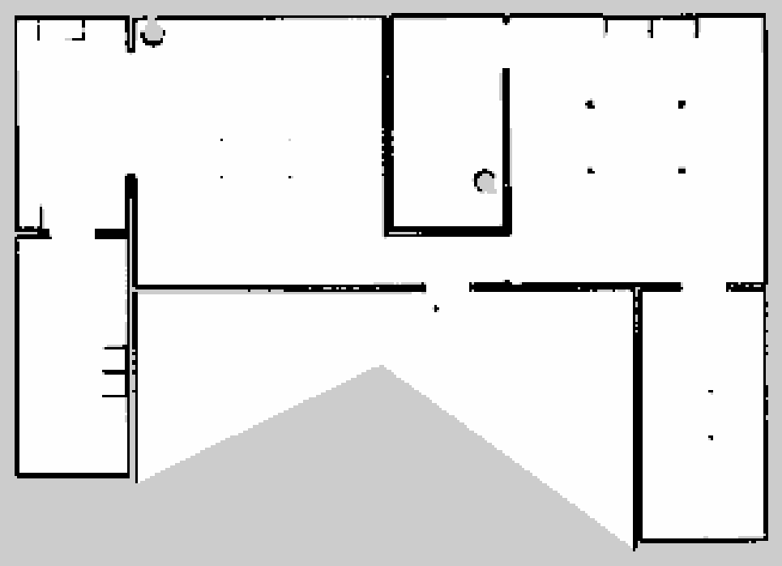
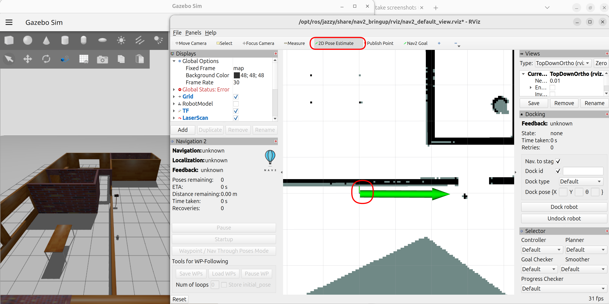
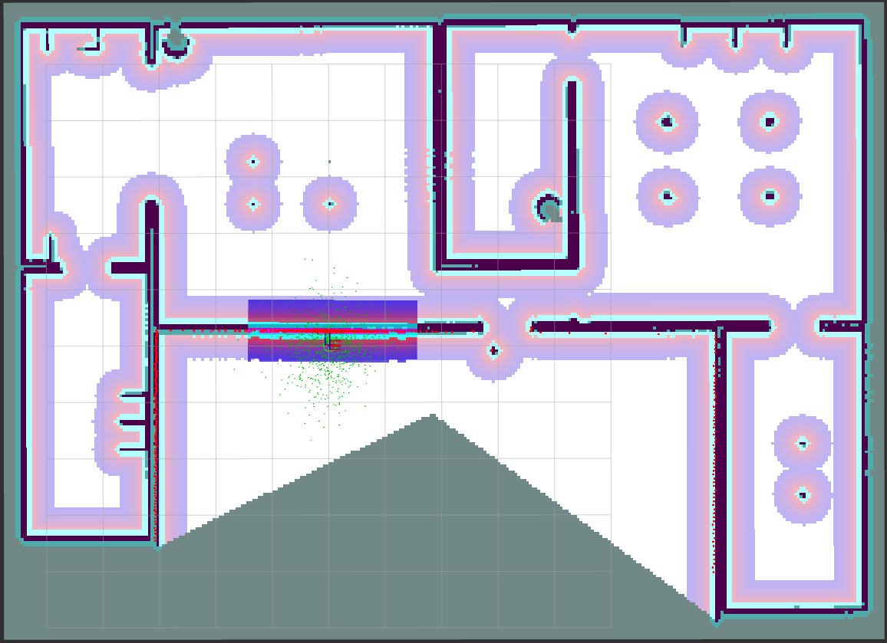
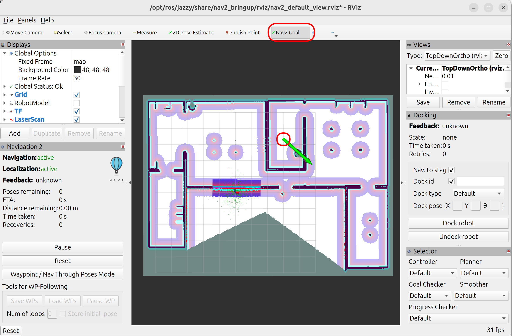
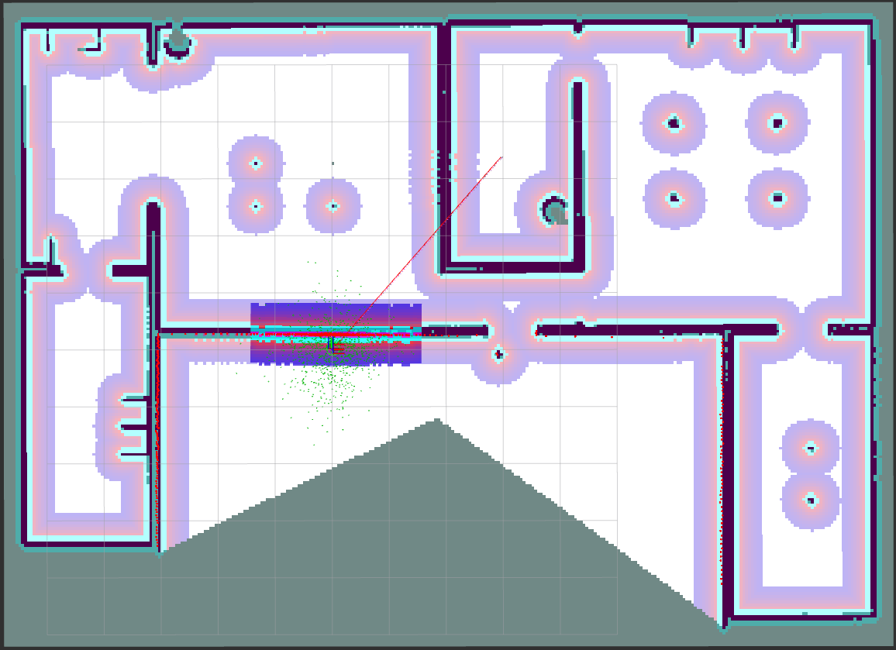
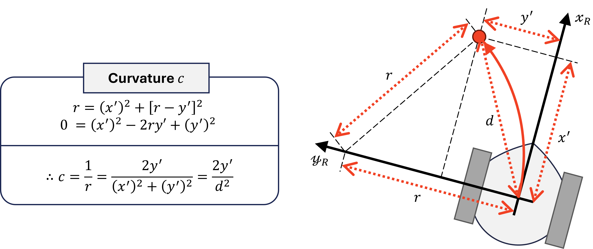

Lab 1: Designing a Nav2 Controller Plugin
==============

***EE4308 Autonomous Robot Systems***

***AY25/26 Sem 2***

**&copy; Lai Yan Kai, National University of Singapore**

# Table of Contents

[1&emsp;Administrative Matters](#1administrative-matters)

&emsp;[1.1&emsp;Submittables](#11submittables)

&emsp;&emsp;[1.1.1&emsp;Answers to L1 Questions](#111answers-to-l1-questions)

&emsp;&emsp;[1.1.2&emsp;Zip file to L1](#112zip-file-to-l1)

[2&emsp;Download and Build Files](#2download-and-build-files)

[3&emsp;Simulating SLAM with Cartographer](#3simulating-slam-with-cartographer)

[4&emsp;Simulating Navigation with Nav2](#4simulating-navigation-with-nav2)

[5&emsp;Pure Pursuit](#5pure-pursuit) 

&emsp;[5.1&emsp;Relevant Files](#51relevant-files)

&emsp;[5.2&emsp;Implement `computeVelocityCommands()`](#52implement-computevelocitycommands)

&emsp;[5.3&emsp;Building and Testing](#53building-and-testing)

[6&emsp;Questions](#6questions)


# 1&emsp;Administrative Matters
Take note of the deadline and install all relevant software before proceeding to the lab. This section and all subsequent sections assume that instructions in the installation guide were followed.

| Overview | Description |
| -- | -- |
| **Effort** | Individual work. |
| **Deadline** | W5 Fri, 23:59. | 
| **Submission** | Submit answers to **L1 Questions** on Canvas, and a zip file to **L1** on Canvas. More details below. |
| **Software** | ROS2 Jazzy on Ubuntu 24.04 LTS. See installation instructions on https://github.com/LaiYanKai/Misc/blob/main/ee4308/01_Where_To_Install_Ubuntu.md. |
| **Lab Computers**| If installation is not possible after trying, a lab computer can be loaned. Please email the TA / GA / Lecturer for a computer, based on instructions on Canvas. |

## 1.1&emsp;Submittables

### 1.1.1&emsp;Answers to L1 Questions
Submit the answers for the three questions from [6 Questions](#6questions) on the Canvas Quiz.

### 1.1.2&emsp;Zip file to L1
Submit a zip file containing the code to Canvas. To avoid penalties, 
1. Named the zip as `l1_<matric>.zip` where `<matric>` is your student number in **lowercase** (e.g. `l1_a0987654n.zip`). 
2. Rename the workspace folder to `l1_<matric>`.
3. Ensure that the zip file have the following structure. Do not zip other files or directories.

<table><tbody><tr><td>
    <details open>
        <summary><code>l1_a0987654n.zip</code>&emsp;The zip file.</summary>
        <dl>
            <dd><details open>
                <summary><code>l1_a0987654n/</code>&emsp;The renamed workspace directory.</summary>
                <dl>
                    <dd><details open> 
                        <summary><code>src/</code>&emsp;Contains packages.</summary>
                        <dl>
                            <dd><details open>
                                <summary><code>ee4308_bringup/</code>&emsp;Package containing scripts that start the projects.</summary>
                                <dl>
                                    <dd><details open>
                                        <summary><code>params/</code></summary>
                                        <dl>
                                            <dd><code>proj1.yaml</code>&emsp;Contains adjustable parameter values.</dd>
                                        </dl>
                                    </details></dd>
                                </dl>
                            </details></dd>
                            <dd><details open>
                                <summary><code>ee4308_turtle/</code>&emsp;Package implementing the turtlebot's controller</summary>
                                <dl>
                                    <dd><details open>
                                        <summary><code>include/</code>&emsp;Directory for <code>.hpp</code> header files.</summary>
                                        <dl>
                                            <dd><details open>
                                                <summary><code>ee4308_turtle/</code></summary>
                                                <dl>
                                                    <dd><code>controller.hpp</code>&emsp;Contains code declarations for the controller.</dd>
                                                </dl>
                                            </details></dd>
                                        </dl>
                                    </details></dd>
                                    <dd><details open>
                                        <summary><code>src/</code>&emsp;Directory for <code>.cpp</code> files.</summary>
                                        <dl>
                                            <dd><code>controller.cpp</code>&emsp;Contains code definitions for the controller. To complete <code>computeVelocityCommands()</code>.</dd>
                                        </dl>
                                    </details></dd>
                                </dl>
                            </details></dd>
                        </dl>
                    </details></dd>
                </dl>
            </details></dd>
        </dl>
    </details>
</td></tr></tbody></table>

# 2&emsp;Download and Build Files 

1. In Ubuntu, open a terminal with `Ctrl+Alt+T`.

2. On the terminal, clone the GitHub repository:
    ```bash
    cd ~
    git clone -b 2520-proj1 https://github.com/LaiYanKai/ee4308
    ```

3. Let the `ee4308` folder be known as the **workspace** folder. Navigate into the workspace folder, and build the files.
   ```bash
   colcon build --symlink-install
   ```
    Wait for about a minute.

# 3&emsp;Simulating SLAM with Cartographer
In this section, we map a simulated environment to obtain its map. 
<!-- This section assumes that the installation guides were followed, such that `~/.bashrc` has sourced the ROS installation, and `TURTLEBOT3_MODEL` has been set. -->

1. In Ubuntu, open a terminal with `Ctrl+Alt+T`, or use an existing terminal. Let this be **terminal A**. 
   
2. Change directory into the workspace if not already, and source the installation folders that were built:
    ```bash
    source install/setup.bash
    ```
    This command only needs to be **run once** for every terminal until it is closed.

3. Launch the SLAM simulation.
    - If using VirtualBox,
        ```bash
        ros2 launch ee4308_bringup proj1_sim_slam.launch.py libgl:=True
        ```
    - If dual booted and using Ubuntu natively,
        ```bash
        ros2 launch ee4308_bringup proj1_sim_slam.launch.py
        ```
4. **Do this step only if you have problems starting the simulation**. If the simulation takes more than about 10 seconds to load and the robot does not spawn, stop the simulation by:
    1. Sending `Ctrl+C` in terminal A. 
    2. The following may then be run to cleanly remove all running Gazebo instances:
        ```bash
        pkill -9 ruby
        ```

5. After launching, RViz and Gazebo will open. 
The robot is initially pointing to the right in RViz, and to the top in Gazebo.

    

6. Open a new terminal (call it **terminal B**), either by `Ctrl+Alt+T` or organizing the terminals by `Ctrl+Shift+O` in terminal A.

7. In terminal B, start tele-operation with:
    ```bash
    TURTLEBOT3_MODEL=burger ros2 run turtlebot3_teleop teleop_keyboard
    ```

7. Begin moving the robot around the map using tele-operation while using SLAM to contruct the occupancy grid in RViz. Take about 10 minutes to map the whole area. The following tips will be useful:

    - Turn left first before moving forward to steer away from the wall near the starting point.
    - The tele-operation is not initially intuitive. If you crash into the wall and the robot is unable to recover, interrupt both terminals with `Ctrl+C`, and re-begin from Step 3.

    - Pan and orbit the camera in RViz with `Shift+Drag` and `Drag` respectively. Drag by holding the mouse button and moving across the screen.

    - Pan and orbit the camera in Gazebo with `Drag` and `Shift+Drag` respectively.
      
    - After interacting with other windows, always go back to terminal B to resume tele-operation. When terminal B is not active, any key presses meant for tele-operation will not be captured.
  

   
  
8. After the entire area is mapped, stop the teleopration in terminal B with `Ctrl+C`. **Do not stop terminal A**, or else the entire mapping process has to be repeated.
   
9. In terminal B, save the map into the `ee4308_bringup` package. Then, build the workspace to install the map, so that the map can be found later by the executables:
    ```bash
    ros2 run nav2_map_server map_saver_cli -f ~/ee4308/src/ee4308_bringup/maps/proj1_sim
    cd ~/ee4308
    colcon build --symlink-install
    ```

11. After the build completes, `Ctrl+C` terminal A to stop the SLAM operation.
    
# 4&emsp;Simulating Navigation with Nav2
In this section, the map created from SLAM is used for navigation by the ROS2 Nav2 software. This section assumes that the installation guides were followed.

1. In Ubuntu, on a new or existing terminal, source the workspace's installation folders if not already:
    ```bash
    cd ~/ee4308
    source install/setup.bash
    ```

2. Launch the navigation with:
    - If using VirtualBox,
        ```bash
        ros2 launch ee4308_bringup proj1_sim.launch.py libgl:=True
        ```
    - If dual booted and using Ubuntu natively,
        ```bash
        ros2 launch ee4308_bringup proj1_sim.launch.py
        ```
    
    The Gazebo graphic interface does not need to be launched for the simulation to work. To do so, you may *append* the command above with `headless:=true` to free up computational resources.

3. **If there are problems starting the simulation**, `Ctrl+C` the terminal and run `pkill -9 ruby` to stop Gazebo, like the previous session.

3. Observe the starting pose (position and rotation) of the robot in Gazebo, and find the corresponding position in RViz. Both views are now pointing in the same direction, which is different from the SLAM section. 

4. On RViz, click `2D Pose Estimate`, and from the robot's position in RViz, drag the green arrow in the direction where the robot is facing, as shown:

    


5. Wait for a few seconds and the map would be filled with inflation layers in RViz, and the initial position is filled with green particles representing guesses of the robot's position in AMCL.
    
    

6. Click `Nav2 Goal`, and create a goal pose in RViz like the step above.

    

7. The red path will be generated by the existing implementation, which cuts through the obstacles.

    

    The task in lab 1 is to create a pure-pursuit controller as a Nav2 controller plugin to follow the red path. In project 1, improve the pure-pursuit controller to a well-designed regulated pure-pursuit controller and implement a global planner such as A* to move around the obstacles.

9. Stop the navigation by sending a `Ctrl+C` in the terminal.

# 5&emsp;Pure Pursuit 
In this lab, implement a simple pure pursuit controller as part of a Nav2 controller plugin.

Pure pursuit finds the **lookahead point** along a path that is at least a lookahead-distance away from the closest point.


Let the lookahead point's coordinates in the **world frame** be $(x_l, y_l)$, and its coordinates in the **robot frame** be $(x', y')$. 
Suppose the robot's coordinates in the world frame be $(x_r, y_r)$, with a heading that is $\phi_r$. The following relationship can be derived:


The curvature required to move the robot to the lookahead point is the inverse of the turn radius required to reach it.



The linear forward velocity $v$ is a constant velocity that is decided by the programmer, and the yaw angular velocity $\omega$ is calculated as $\omega = v c$.


## 5.1&emsp;Relevant Files
The following files will be relevant for this task.

| Name | Path | Description |
| --- | --- | --- |
| Controller header file | `ee4308_turtle/ include/ ee4308_turtle/ controller.hpp` | Declare functions and class variables here. Modifications will require re-building with `colcon build`. |
| Controller source file | `ee4308/ src/ ee4308_turtle/ src/ controller.cpp` | Define the functions here. Modifications will require re-building. |
| Parameter file | `ee4308/ src/ ee4308_bringup/ params/ proj1.yaml` | Contains parameter values that are fed into the programs when launched. Modifications do not require re-building. |

## 5.2&emsp;Implement `computeVelocityCommands()`
The task is to program a simple pure-pursuit controller with velocity constraints, into the `computeVelocityCommands()` function that is located in the `controller.cpp` file. 
The function is a custom override of the Nav2 controller plugin.
Pseudocode is provided at the bottom of this section.

The following input variables are accessible by the function and *must* be used. Some are ROS2 parameters that can be tuned from the parameter file `proj1.yaml`.
| Input Variable | Type | Parameter | Description |
| --- | --- | --- | --- |
| `rbt_pose` | `geometry_msgs::msg::PoseStamped` | No | Robot's current pose in world frame. |
| `goal_pose` | `geometry_msgs::msg::PoseStamped` | No | Goal's current pose in world frame. |
| `global_plan_` | `nav_msgs::msg::Path` | No | Contains the poses of the points along the global path, between a start pose (robot's position) and a goal pose. The poses are contained in the `poses` property. |
| `desired_linear_vel_` | `double` | Yes | To be tuned. The desired linear velocity in pure pursuit. |
| `desired_lookahead_dist_` | `double` | Yes | To be tuned. The desired lookahead distance in pure pursuit. |
| `max_angular_vel_` | `double` | Yes | Fixed at `1.0` rad/s. The maximum angular velocity allowed on the robot. |
| `max_linear_vel_` | `double` | Yes | Fixed at `0.22` m/s. The maximum linear velocity allowed on the robot. |
| `xy_goal_thres_` | `double` | Yes | Fixed at `0.05` m. The robot has to stop if it is smaller than this distance away from the goal pose. |
        
| Returns | Type | Description |
| --- | --- | --- |
| Command velocities | `geometry_msgs::msg::Twist` | Use the provided `writeCmdVel()` function to return the linear and angular velocities. |

Keeping in mind the input and returned variables from above, implement the function based on the following pseudocode:

1. **Function** computerVelocityCommands()
2. &emsp;**If** no global path **Then** 
3. &emsp;&emsp;**Return** $(0, 0)$ &emsp;&#x25B6; *Zero linear and angular velocities.* 
4. &emsp;**End If**
5. &emsp;**If** the robot is close to the goal **Then** &emsp;&#x25B6; *Goal is the last point on the path.* 
6. &emsp;&emsp;**Return** $(0, 0)$
7. &emsp;**End If**
8. &emsp;Find the point along the path that is closest to the robot. 
9. &emsp;From the closest point, find the lookahead point.
10. &emsp;Transform the lookahead point into the robot frame to get $(x',y')$.
11. &emsp;Calculate the curvature $c$.
12. &emsp;Calculate $\omega$ from $v$ and $c$.
13. &emsp;Constrain $\omega$ to within the largest allowable angular speed.
14. &emsp;Constrain $v$ to within the largest allowable linear speed.
15. &emsp;**Return** $(v, \omega)$
16. **End Function**

You may refer to [tips.md](tips.md) for programming tips and useful functions.

## 5.3&emsp;Building and Testing
To test any modification made to the source and header files, the workspace has to be built, and the simulation has to be run.

1. Build the workspace and source it.
    ```bash
    cd ~/ee4308
    colcon build --symlink-install
    source install/setup.bash
    ```
2. Test to see if the controller is working by running the following commands from Section 4. 
    - If using VirtualBox,
        ```bash
        ros2 launch ee4308_bringup proj1_sim_slam.launch.py libgl:=True
        ```
    - If dual booted and using Ubuntu natively,
        ```bash
        ros2 launch ee4308_bringup proj1_sim.launch.py
        ```
    Remember to estimate the initial robot position. Place the goal pose such that the straight line path does not intersect any obstacle. 

3. Assuming no logical errors, the code is complete once the robot is able to follow the points along the straight-line path to the goal.


# 6&emsp;Questions
On Canvas **L1 Questions** Quiz, answer the following questions. What are problem(s) that could occur, when...
1. The lookahead distance is too large or small?
2. The desired linear velocity is too large, especially if the lookahead point is to the side of the robot, such that $y' < 0$?
3. The lookahead point is behind the robot, such that $x' < 0$? You may need to examine some formulas to answer this question.
